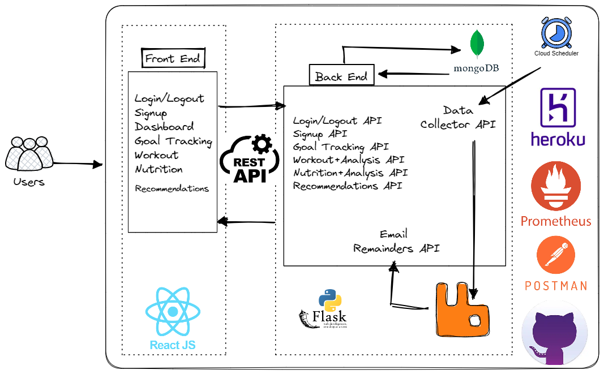

# Fitness Tracker Application
| Team: Devs on the go |
| :------: | 
|    Sai Akhil Teja |
|    Sharon Moses |
|    Manali Kale |
|    Saksham Srivastava |
|    Pavit Singh Nagpal  |

### Introduction

Our application helps users lead a healthier and more active lifestyle by providing them with tools to track their progress and make informed decisions about their fitness and nutrition goals. Our application provides the following functionalities:
- Goal tracking
- Work out tracking
- Nutrition tracking
- Reminders
- Personal Recommendations

### Project Rubric
| Rubric | Commentary |
| :------ | :------ | 
| Web application: basic form, reporting | We are implementing front end using [React JS](https://github.com/CSCI-5828-Foundations-Sftware-Engr/Fitness_tracker_web_application/tree/main/fitness-tracker-react) and using [REST API](https://github.com/CSCI-5828-Foundations-Sftware-Engr/Fitness_tracker_web_application/blob/main/app.py) communication to interact with the backend APIs  |
| Data collection | We have a cron job that periodically calls a [data_collector](https://github.com/CSCI-5828-Foundations-Sftware-Engr/Fitness_tracker_web_application/blob/43c4115592139ff33079d425e1e969dc900a109a/app.py#L658) API. This API first fetches latest recepies with high protein diet, low fat diet, low carb diet and balanced diet. It also averages the fat, protein, and carbs consumption for each user and writes that to the Mongo Db. Based on user's consumption and goals, the API add user-events on to the RabbitMQ messaging queue.|
| Data analyzer | Our Data analysis for [Workout](https://github.com/CSCI-5828-Foundations-Sftware-Engr/Fitness_tracker_web_application/blob/main/fitness-tracker-react/src/Workout.js), [Nutrition](https://github.com/CSCI-5828-Foundations-Sftware-Engr/Fitness_tracker_web_application/blob/main/fitness-tracker-react/src/Nutrition.js) is done on-demand i.e. whenever the user wishes to see/record his workout information or the nutrition consumption information, we analyze the past workout/nutrition data and display as charts. These charts capture trends in the user's calorie consumption, calories burnt, protein consumption, fat consumption, carbs consumption, water intake and compare the same with the corresponding goals set by user. |
|  Unit tests | We have written unit tests to test our functionality and can be [found](https://github.com/CSCI-5828-Foundations-Sftware-Engr/Fitness_tracker_web_application/tree/main/tests) here. These unit tests are run as part of github workflows everytime a push or pull is done on the main branch. |
|  Data persistence any data store | We used a distributed database - MongoDb with 1 primary node and 2 secondary nodes hosted on Atlas. Data Persistence and fault tolerance is guaranteed since its Database-as-a-service. The schema and cluster information can be found [here](https://cloud.mongodb.com/v2/6440725595bfd24694da1830#/clusters/detail/Cluster0)|
| Rest collaboration internal or API endpoint | We used Flask to host our webserver and gunicorn on [heroku](https://fitness-tracker-staging.herokuapp.com/). The backend code for REST APIs and hosting Flask server can be found [here](https://github.com/CSCI-5828-Foundations-Sftware-Engr/Fitness_tracker_web_application/blob/main/app.py).|
| Product environment | We are using heroku as our production environment and our app can be found [here](https://fitness-tracker-staging.herokuapp.com/). Our pipeline has two applications running, the first one to host our fitness tracker application and the second to collect the metrics using [prometheus](https://fitness-prometheus.herokuapp.com/graph) |
| Integration tests | We are using Postman for integration testing. For this project, we mandated all integration tests to work and is added as part of the GitHub workflow. The Postman collection thoroughly tests each functionality and the json info regarding the collection be found [here](https://github.com/CSCI-5828-Foundations-Sftware-Engr/Fitness_tracker_web_application/blob/main/tests/Fitness-Tracker-Integration-Tests.postman_collection.json). |
| Using mock objects or any test doubles | We used Postman to create mock server and also we are using mock objects to mock mongo connections. More info can be found [here](https://github.com/CSCI-5828-Foundations-Sftware-Engr/Fitness_tracker_web_application/tree/main/tests/mock).|
| Continuous integration | We are using GitHub actions for ensuring continuous integration. We mandate the build to be successful, all unit, mock and integration tests should be working for a successful integration. |
| Production monitoring instrumenting | We used prometheus for this and is hosted [here](https://fitness-prometheus.herokuapp.com/graph). Our prometheus metrics include but not limited to counters (successful, failure, and error scenarios) for each API endpoint, up time, total API requests, responses, etc.  |
| Acceptance tests   | For acceptance tests, we did a detailed manual testing of the accepted functionalities for our application and have attached the same [here](https://github.com/CSCI-5828-Foundations-Sftware-Engr/Fitness_tracker_web_application/tree/main/tests). For backend, we used a Postman [collection](https://github.com/CSCI-5828-Foundations-Sftware-Engr/Fitness_tracker_web_application/blob/main/tests/Fitness-Tracker-Acceptance-Tests.postman_collection.json) for acceptance tests which is run before every deployment. |
| Event collaboration messaging | We are using RabbitMQ messaging queue for this purpose and the code can be found [here](https://github.com/CSCI-5828-Foundations-Sftware-Engr/Fitness_tracker_web_application/blob/main/email_reminders.py). The publisher for this queue would be the data collector API and the subscriber would be the send_email API that sends email to users sharing their progress and reminding them if they are falling back. |
| Continuous delivery | We are using Heroku for implementing contiuous delivery. |

### Architecture Diagram

<p align="center">
  
</p>

- In this architecture, React.js is used for the frontend, Python and Flask are used for the backend, and MongoDB is used as the database. The external API sends requests to the backend, which is responsible for processing the requests and communicating with the database.

- When a user accesses the fitness tracker web application through their browser, the frontend built with React.js sends requests to the backend REST API, which communicates with the MongoDB database to retrieve or store data related to the user's fitness activities.

- The backend is responsible for processing requests from the frontend and communicating with the database to retrieve or store data. In addition, the backend communicates with the external API to retrieve relevant fitness data, such as the user's daily steps and calories burned.

- The MongoDB database stores all the data related to the user's fitness activities, including their goals, progress, and achievements.

- Heroku, a cloud platform, is used to host the fitness tracker web application. Heroku provides a scalable and secure infrastructure for the application to run on, and it can handle large amounts of traffic without any downtime.

Overall, this architecture allows users to track and monitor their fitness activities, set goals, and view their progress over time.

### Build Instructions

#### Backend 
To run the backend server on local machine.
```
flask run
```
#### Frontend
To run the frontend react application on local machine.
```
npm install
npm start
```
#### Heroku deployment
```
heroku login
git push heroku main
```

### Useful Links
- [Project Wiki](https://github.com/CSCI-5828-Foundations-Sftware-Engr/5828_s23/wiki/Fitness-Tracker-Application)
- [Trello Board](https://trello.com/b/3nAg4jrF/fitness-tracker)
- [Web App](https://fitness-tracker-staging.herokuapp.com/)
- [Prometheus](https://fitness-prometheus.herokuapp.com/graph)
